# Operators in C++
Operators are **symbols** that tell the compiler to perform specific
operations on operands (values or variables).

Operators are one of the **most important building blocks** in C++ because:
- They help perform calculations
- They control logic and conditions
- They are heavily used in loops and DSA problems

## 🔹 C++ Operator Types
C++ operators are classified based on:
1. **Purpose** (Arithmetic, Relational, Logical, etc.)
2. **Number of operands** they work on

In this section, we focus on **Arithmetic Operators**, which are the foundation
for calculations and logic building.

## 🔹 1. Arithmetic Operators in C++

Arithmetic operators are used to perform **basic mathematical operations**.

### 📘 List of Arithmetic Operators

| Operator | Name | Description |
|-------|------|------------|
| `+` | Addition | Adds two operands |
| `-` | Subtraction | Subtracts right operand from left |
| `*` | Multiplication | Multiplies two operands |
| `/` | Division | Divides left operand by right |
| `%` | Modulo | Returns remainder |
| `++` | Increment | Increases value by 1 |
| `--` | Decrement | Decreases value by 1 |

### 1️⃣ Addition Operator (`+`)

```cpp
int a = 10;
int b = 5;
int sum = a + b;

cout << sum;
```
* Adds two operands
* Works with integers and floating-point numbers

### 2️⃣ Subtraction Operator (`-`)
```cpp
int a = 10;
int b = 4;
int diff = a - b;

cout << diff;
```
* Subtracts right operand from left

### 3️⃣ Multiplication Operator (`*`)
```cpp
int a = 6;
int b = 5;
int product = a * b;

cout << product;
```
* Multiplies two values

### 4️⃣ Division Operator (`/`)
```cpp
int a = 10;
int b = 3;

cout << a / b;
```
Output:
```cpp
3
```
Explanation:
* Integer division discards the decimal part

**Division with Floating-Point Values**
```cpp
float a = 10;
float b = 3;

cout << a / b;
```
Output:
```cpp
3.33333
```
* Division works with floating-point numbers

### 5️⃣ Modulo Operator (`%`)
The modulo operator returns the **remainder** after division.
```cpp
int a = 10;
int b = 3;

cout << a % b;
```
Output:
```cpp
1
```
**🔴 Important Point (VERY IMPORTANT)**
> The modulo operator (`%`) works only with integers.

❌ Invalid:
```cpp
float a = 10.5;
float b = 2.5;
// cout << a % b;  ❌ Error
```
✔ Valid:
```cpp
int a = 10;
int b = 3;
cout << a % b;
```

### 6️⃣ Increment Operator (`++`)
The increment operator increases a variable’s value by 1.

There are two types:
1. Pre-increment (++a)
2. Post-increment (a++)

### Pre-Increment (`++a`)
```cpp
int a = 5;
int b = ++a;

cout << a << " " << b;
```
Output:
```cpp
6 6
```
Explanation:
* Value of `a` is incremented first
* Then assigned to `b`

### Post-Increment (`a++`)
```cpp
int a = 5;
int b = a++;

cout << a << " " << b;
```
Output:
```cpp
6 5
```
Explanation:
* Value of `a` is assigned first
* Then incremented

### 7️⃣ Decrement Operator (--)
The decrement operator decreases a variable’s value by 1.

### Pre-Decrement (`--a`)
```cpp
int a = 5;
int b = --a;

cout << a << " " << b;
```
Output:
```cpp
4 4
```

### Post-Decrement (`a--`)
```cpp
int a = 5;
int b = a--;

cout << a << " " << b;
```
Output:
```cpp
4 5
```

---

## 🔹 Operators Based on Number of Operands
Operators are also classified based on how many **operands** they work with.

### 1️⃣ Unary Operators
Unary operators work on **a single operand**.

Examples
```cpp
int a = 5;
cout << ++a;
```
Common unary operators:
* `++`
* `--`
* `!` (logical NOT)
* `-` (unary minus)

### 2️⃣ Binary Operators
Binary operators work on **two operands**.

Examples
```cpp
int a = 10;
int b = 5;

cout << a + b;
```
Most arithmetic, relational, and logical operators are binary.

### 3️⃣ Ternary Operator (`?:`)

The ternary operator works on **three operands**.

**Syntax**
```cpp
condition ? expression1 : expression2;
```
Example
```cpp
int a = 10;
int b = 20;

int max = (a > b) ? a : b;
cout << max;
```
Explanation:
* If condition is true → `expression1`
* Else → `expression2`

### 🔹 Summary
* Operators perform operations on variables and values
* Arithmetic operators handle calculations
* `%` works only with integers
* `++a` and `a++` behave differently
* Operators are classified as:
  * Unary
  * Binary
  * Ternary

Understanding operators is **crucial for logic building**, loop control,
and solving **DSA problems efficiently**.

---

## 🔹 2. Relational Operators in C++
Relational operators are used to **compare two values or variables**.
They return a **boolean result**:
- `true` (1)
- `false` (0)

These operators are heavily used in:
- Conditions
- Loops
- Decision making

### 📘 List of Relational Operators
| Operator | Name | Description |
|-------|------|------------|
| `==` | Equal to | Checks if two values are equal |
| `!=` | Not equal to | Checks if values are not equal |
| `>` | Greater than | Checks if left > right |
| `<` | Less than | Checks if left < right |
| `>=` | Greater than or equal to | Checks if left ≥ right |
| `<=` | Less than or equal to | Checks if left ≤ right |

Example
```cpp
int a = 10;
int b = 20;

cout << (a == b);   // 0
cout << (a != b);   // 1
cout << (a > b);    // 0
cout << (a < b);    // 1
cout << (a >= b);   // 0
cout << (a <= b);   // 1
```
**Important Note**
❌ Do NOT confuse:
```cpp
a = b;   // Assignment
a == b;  // Comparison
```

---

## 🔹 3. Logical Operators in C++
Logical operators are used to **combine or modify conditions** and always return
a boolean result (`true` or `false`).

### 📘 List of Logical Operators in C++
| Operator | Name | Description |
|---------|------|-------------|
| `&&` | Logical AND | Returns `true` if **both conditions** are true |
| `\|\|` | Logical OR | Returns `true` if **at least one condition** is true |
| `!` | Logical NOT | Reverses the result of a condition |

### Logical AND (`&&`)
```cpp
int age = 20;

if (age >= 18 && age <= 60) {
    cout << "Eligible";
}
```
✔ Both conditions must be true

### Logical OR (`||`)
```cpp
int day = 6;

if (day == 6 || day == 7) {
    cout << "Weekend";
}
```
✔ At least one condition must be true

### Logical NOT (`!`)
```cpp
bool isLoggedIn = false;

if (!isLoggedIn) {
    cout << "Please login";
}
```
✔ Reverses the boolean value

---

## 🔹 4. Bitwise Operators in C++

Bitwise operators work at the **bit level (0s and 1s)**.
They are commonly used in:
* Low-level programming
* Optimization
* Competitive programming

### 📘 Bitwise Operators List
| Operator | Name             | Description       |        
| -------- | ---------------- | ----------------- |
| `&`      | Bitwise AND      | AND operation     |    
| `        | `                | Bitwise OR        | 
| `^`      | Bitwise XOR      | Exclusive OR      |        
| `<<`     | Left Shift       | Shifts bits left  |             
| `>>`     | Right Shift      | Shifts bits right |              
| `~`      | One’s Complement | Inverts bits      |       

### Bitwise AND (`&`)
```cpp
int a = 5;   // 0101
int b = 3;   // 0011

cout << (a & b);   // 1
```

### Bitwise OR (`|`)
```cpp
cout << (a | b);   // 7
```

### Bitwise XOR (`^`)
```cpp
cout << (a ^ b);   // 6
```

### Left Shift (`<<`)
```cpp
int x = 5;
cout << (x << 1);  // 10
```
Explanation:
* Shifts bits left
* Multiplies by 2

### Right Shift (`>>`)
```cpp
cout << (x >> 1);  // 2
```
Explanation:
* Shifts bits right
* Divides by 2

### One’s Complement (`~`)
```cpp
int x = 5;
cout << ~x;
```
Explanation:
* Flips all bits
* Result is negative due to two’s complement

---

## 🔹 5. Assignment Operators in C++
Assignment operators are used to **assign values** to variables.

### 📘 Assignment Operators List
| Operator | Meaning             | Example  |
| -------- | ------------------- | -------- |
| `=`      | Assignment          | `a = 5`  |
| `+=`     | Add and assign      | `a += 3` |
| `-=`     | Subtract and assign | `a -= 2` |
| `*=`     | Multiply and assign | `a *= 4` |
| `/=`     | Divide and assign   | `a /= 2` |

Example
```cpp
int a = 10;

a += 5;   // 15
a -= 3;   // 12
a *= 2;   // 24
a /= 4;   // 6
```

### Why Use Assignment Operators?
* Shorter code
* Cleaner syntax
* Better readability

---

## 🔹 6. Ternary (Conditional) Operator
The ternary operator is a short-hand replacement for `if-else`.

### Syntax
```cpp
condition ? expression1 : expression2;
```

Example
```cpp
int a = 10;
int b = 20;

int max = (a > b) ? a : b;
cout << max;

Equivalent if-else
int max;
if (a > b)
    max = a;
else
    max = b;
```
### Key Points
| Feature       | Description          |
| ------------- | -------------------- |
| Operands      | 3                    |
| Operator type | Ternary              |
| Use case      | Simple conditions    |
| Readability   | High for small logic |


### ✅ Summary
* Relational operators compare values
* Logical operators combine conditions
* Bitwise operators work on bits
* Assignment operators simplify updates
* Ternary operator replaces simple if-else

These operators form the **core logic-building tools** required for:
* Conditions
* Loops
* Competitive programming
* DSA problem solving

---

## 🔹 Miscellaneous Operators in C++

Apart from arithmetic, relational, logical, and assignment operators,
C++ provides several **miscellaneous operators** that are extremely important
for memory handling, object access, and advanced programming.

### 1️⃣ `sizeof` Operator

The `sizeof` operator is used to determine the **size (in bytes)** of a data type or variable.

### Syntax
```cpp
sizeof(data_type);
sizeof(variable);
```

Example
```cpp
int a;
double b;

cout << sizeof(a) << endl;
cout << sizeof(b) << endl;
```

### Key Points
| Feature     | Description         |
| ----------- | ------------------- |
| Return type | `size_t`            |
| Evaluated   | Compile time        |
| Use case    | Memory optimization |

---

### 2️⃣ Comma Operator (`,`)

The comma operator allows **multiple expressions** to be evaluated in a single statement.
The **value of the last expression** is returned.

Example
```cpp
int x = (10, 20, 30);
cout << x;
```
Output:
```cpp
30
```

### Usage in Loops
```cpp
for (int i = 0, j = 5; i <= j; i++, j--) {
    cout << i << " " << j << endl;
}
```

---

### 3️⃣ Address-of Operator (`&`)

The address-of operator is used to obtain the **memory address of a variable**.

Example
```cpp
int x = 10;
cout << &x;
```

### Key Points
* Returns the address in memory
* Used heavily with pointers
* Important for DSA and memory management

---

### 4️⃣ Dot Operator (.)

The dot operator is used to **access members of a structure or class object**.

Example
```CPP
struct Student {
    int roll;
    float marks;
};

Student s;
s.roll = 1;
s.marks = 95.5;

cout << s.roll << " " << s.marks;
```
### Usage
* Used with objects
* Accesses data members and member functions

---

### 5️⃣ Arrow Operator (->)

The arrow operator is used to **access members of a structure or class through a pointer**.

Example
```CPP
struct Student {
    int roll;
};

Student s;
Student* ptr = &s;

ptr->roll = 10;
cout << ptr->roll;
```

### Difference: Dot vs Arrow
| Operator | Used With         |
| -------- | ----------------- |
| `.`      | Object            |
| `->`     | Pointer to object |

--- 

### 6️⃣ Casting Operators

Casting operators are used to **convert one data type to another**.

### C-style Casting
```cpp
double x = 9.8;
int y = (int)x;
```
### C++ Style Casting (Preferred)
```cpp
int y = static_cast<int>(x);
```
### Why Casting Is Needed
* Type compatibility
* Precision control
* Explicit conversions

---

## 🔹 Operator Precedence in C++

Operator precedence determines **which operator is evaluated first**
when multiple operators appear in an expression.

Example
```cpp
int result = 10 + 5 * 2;
cout << result;
```
Output:
```cpp
20
```
Explanation:

* `*` has higher precedence than `+`
* So multiplication happens first

## 🔹 Operator Precedence in C++

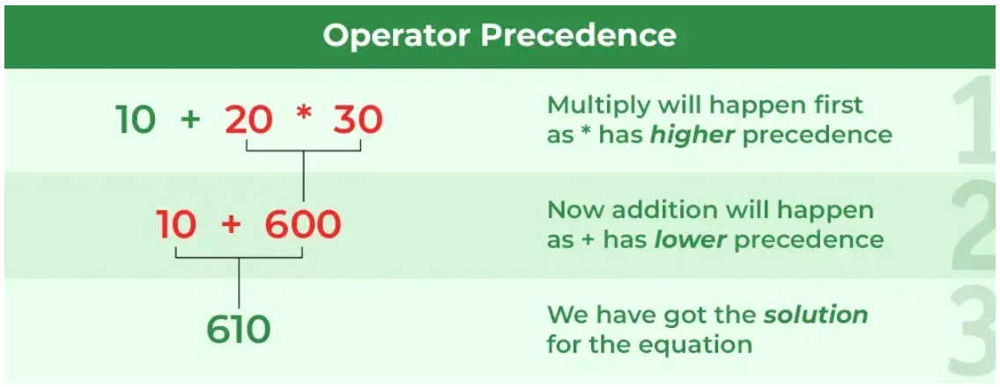


### Common Operator Precedence (High → Low)
| Operator    | Description                        |   
| ----------- | ---------------------------------- | 
| `()`        | Parentheses                        |             
| `++ --`     | Increment / Decrement              |             
| `* / %`     | Multiplication / Division / Modulo |            
| `+ -`       | Addition / Subtraction             |               
| `< <= > >=` | Relational                         |               
| `== !=`     | Equality                           |            
| `&&`        | Logical AND                        |   
| `           |                                    | 
| `=`         | Assignment                         |   
| `,`         | Comma                              |   


### 🔹 Operator Precedence Table (Reference)

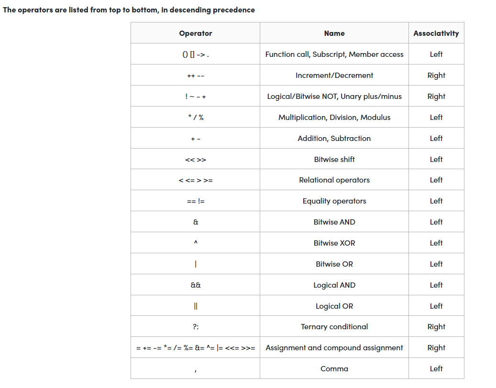

---

## 🔹 Operator Associativity in C++

Associativity determines the direction of **evaluation**
when operators of the same precedence appear together.

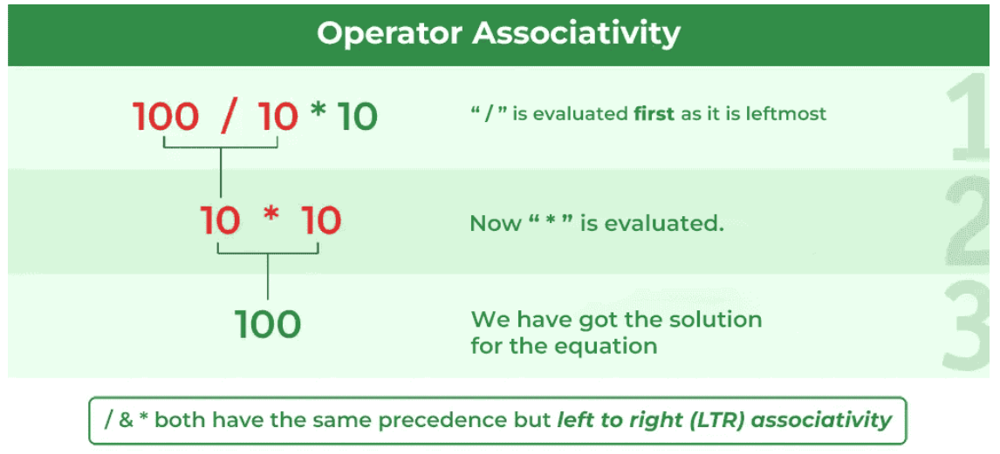

### Types of Associativity
| Associativity | Direction                  |
| ------------- | -------------------------- |
| Left to Right | Most operators             |
| Right to Left | Assignment, unary, ternary |

### Left-to-Right Associativity Example
```cpp
int x = 10 - 5 - 2;
cout << x;
```
Evaluation:
```cpp
(10 - 5) - 2 = 3
```

### Right-to-Left Associativity Example
```cpp
int a, b, c;
a = b = c = 10;
```
Evaluation:
```cpp
a = (b = (c = 10))
```

---

### 🔹 Difference Between Precedence and Associativity
| Feature      | Operator Precedence   | Operator Associativity      |
| ------------ | --------------------- | --------------------------- |
| Meaning      | Priority of operators | Direction of evaluation     |
| Applies when | Different operators   | Same operators              |
| Example      | `*` before `+`        | `=` evaluated right to left |

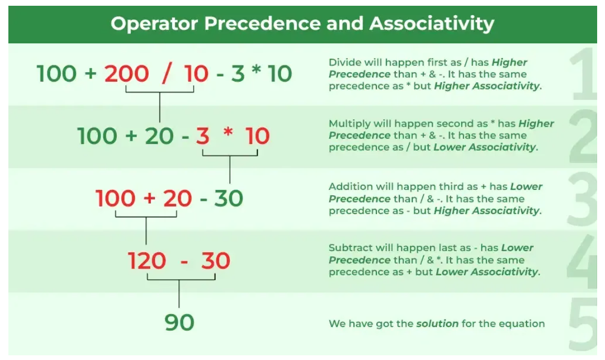

### ✅ Summary
* Miscellaneous operators handle memory, objects, and type conversions
* `sizeof` helps in memory management
* `.` and `->` are used for object member access
* Precedence controls **which operator executes first**
* Associativity controls **execution direction**
Both are crucial for writing correct expressions

Understanding these concepts avoids logical bugs and is extremely important
for **DSA, competitive programming, and interviews**.

---

## 🔹 Decision Making in C++

Decision making allows a program to **choose different paths of execution**
based on certain conditions.

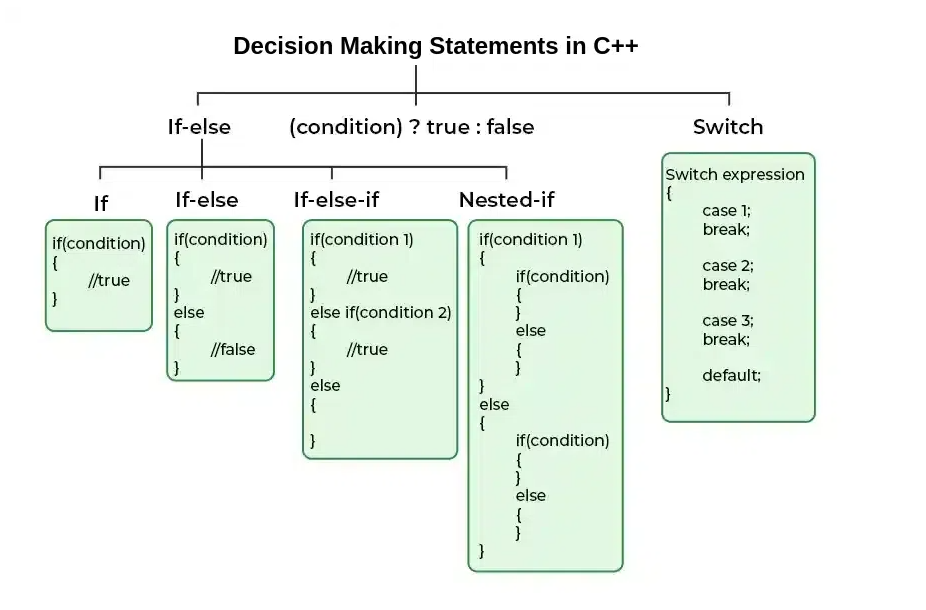

In C++, decision making is done using **conditional statements**, which evaluate
a condition and execute code accordingly.

These concepts are **extremely important** for:
- Logic building
- Problem solving
- DSA and competitive programming

### 🔹 `if` Conditional Statement

The `if` statement executes a block of code **only if the condition is true**.

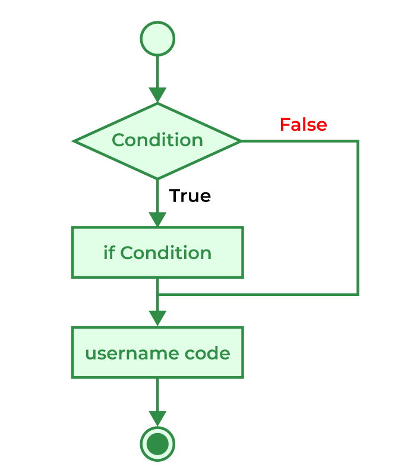


### Syntax

```cpp
if (condition) {
    // code
}

```
### Example (Full Program)
```cpp
#include <iostream>
using namespace std;

int main() {
    int age = 20;

    if (age >= 18) {
        cout << "You are eligible to vote";
    }

    return 0;
}
```
### Important Note

If there is **only one statement**, curly braces `{ }` can be skipped.
```cpp
if (age >= 18)
    cout << "You are eligible to vote";
```
⚠️ However, using **braces is a good practice** to avoid logical errors.

---

### 🔹 `if-else` Statement

The `if-else` statement executes one block if the condition is true,
and another block if the condition is false.

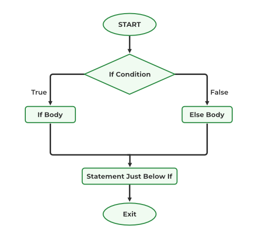

### Syntax
```cpp
if (condition) {
    // true block
} else {
    // false block
}
```
### Example (Full Program)
```cpp
#include <iostream>
using namespace std;

int main() {
    int number;
    cout << "Enter a number: ";
    cin >> number;

    if (number % 2 == 0) {
        cout << "Even number";
    } else {
        cout << "Odd number";
    }

    return 0;
}
```

---

### 🔹 `if-else if` Ladder

The `if-else if` ladder is used when **multiple conditions** need to be checked.

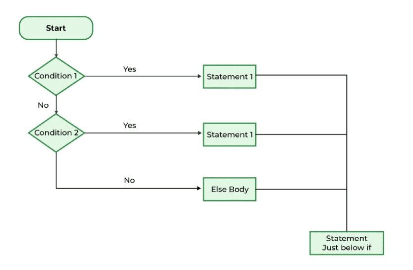

### Syntax
```cpp
if (condition1) {
    // block
} else if (condition2) {
    // block
} else {
    // default block
}
```
### Example (Full Program)
```cpp
#include <iostream>
using namespace std;

int main() {
    int marks;
    cout << "Enter marks: ";
    cin >> marks;

    if (marks >= 90) {
        cout << "Grade A";
    } else if (marks >= 75) {
        cout << "Grade B";
    } else if (marks >= 50) {
        cout << "Grade C";
    } else {
        cout << "Fail";
    }

    return 0;
}
```

---

### 🔹 Nested `if-else`

Nested `if-else` means placing one `if-else` inside another `if-else`.

Used when a decision depends on **multiple levels of conditions**.

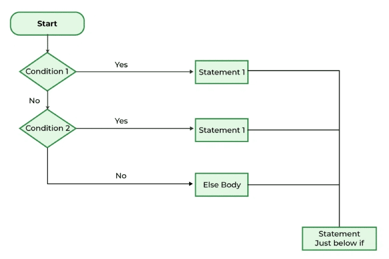

### Example (Full Program)
```cpp
#include <iostream>
using namespace std;

int main() {
    int age;
    bool hasVoterID;

    cout << "Enter age: ";
    cin >> age;

    cout << "Do you have voter ID? (1 for Yes, 0 for No): ";
    cin >> hasVoterID;

    if (age >= 18) {
        if (hasVoterID) {
            cout << "You can vote";
        } else {
            cout << "You need a voter ID";
        }
    } else {
        cout << "You are underage";
    }

    return 0;
}
```

---


### 🔹 `switch` Statement

The `switch` statement is used when a variable is compared against
**multiple constant values**.

It is often cleaner than long `if-else` ladders.

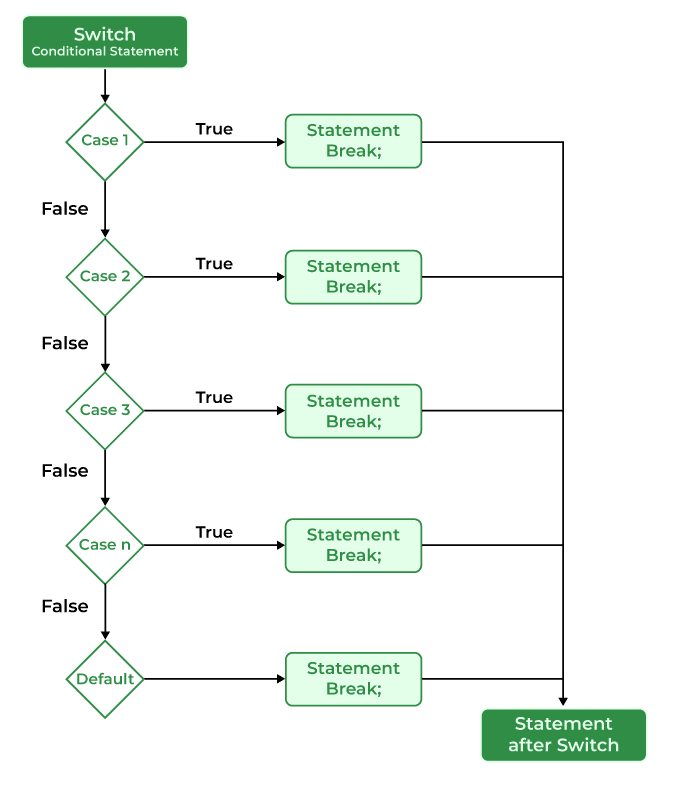

### Syntax
```cpp
switch (expression) {
    case value1:
        // code
        break;
    case value2:
        // code
        break;
    default:
        // code
}
```
### Example (Full Program)
```cpp
#include <iostream>
using namespace std;

int main() {
    int choice;

    cout << "Enter a number (1-3): ";
    cin >> choice;

    switch (choice) {
        case 1:
            cout << "You selected One";
            break;
        case 2:
            cout << "You selected Two";
            break;
        case 3:
            cout << "You selected Three";
            break;
        default:
            cout << "Invalid choice";
    }

    return 0;
}
```
### Important Notes about `switch`
* `break` prevents fall-through
* `case` values must be constants
* `default` executes if no case matches

---

🔹 Ternary Operator (`?:`)

The ternary operator is a **short-hand replacement** for simple `if-else`.

### Syntax
```cpp
condition ? expression1 : expression2;
```
### Example (Full Program)
```cpp
#include <iostream>
using namespace std;

int main() {
    int a, b;

    cout << "Enter two numbers: ";
    cin >> a >> b;

    int max = (a > b) ? a : b;
    cout << "Maximum value is: " << max;

    return 0;
}
```
### 🔹 Comparison: `if-else` vs `Ternary Operator`
| Feature       | if-else               | Ternary               |
| ------------- | --------------------- | --------------------- |
| Readability   | High                  | Medium                |
| Lines of code | More                  | Less                  |
| Complexity    | Handles complex logic | Best for simple logic |

### ✅ Summary
* Decision making controls program flow
* `if` executes code when condition is true
* `if-else` handles two-way decisions
* `if-else if` ladder handles multiple conditions
* Nested `if-else` handles layered logic
* `switch` is useful for fixed choices
* Ternary operator simplifies simple conditions

Decision making is the **heart of logic building** and is used
in almost **every DSA problem**.

---

## 🔹 Jump Statements in C++

Jump statements are used to **alter the normal flow of execution** of a program.
Instead of executing statements sequentially, jump statements allow the program
to **jump to another part of the code**.

They are commonly used in:
- Loops
- Functions
- Conditional logic
- Controlling program execution

C++ provides the following jump statements:
1. `continue`
2. `break`
3. `return`
4. `goto`

---

### 🔹 1. `continue` Statement

The `continue` statement is used **inside loops**.
It skips the **current iteration** and moves directly to the **next iteration** of the loop.

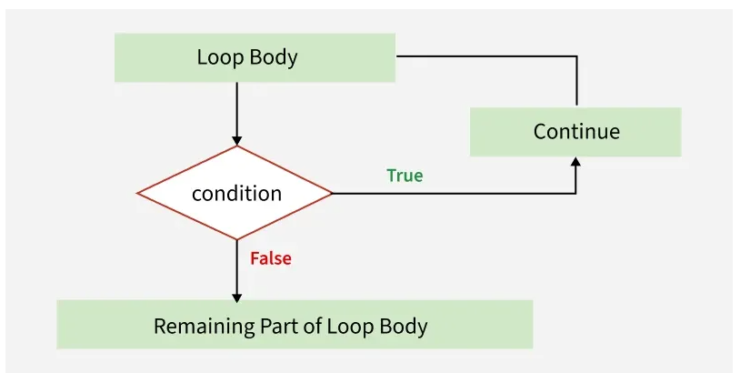

### How `continue` works
- The condition is checked
- If `continue` is encountered:
  - Remaining code in the loop is skipped
  - Loop proceeds to the next iteration

### Example (Full Program)

```cpp
#include <iostream>
using namespace std;

int main() {
    for (int i = 1; i <= 5; i++) {
        if (i == 3) {
            continue;   // skips when i == 3
        }
        cout << i << " ";
    }
    return 0;
}
```
Output
```cpp
1 2 4 5
```

### Key Points
* Used only in loops
* Does NOT terminate the loop
* Skips the current iteration only

---

### 🔹 2. `break` Statement

The `break` statement is used to **immediately terminate a loop or switch statement**.

Once `break` is executed, control moves **outside the loop or switch block**.

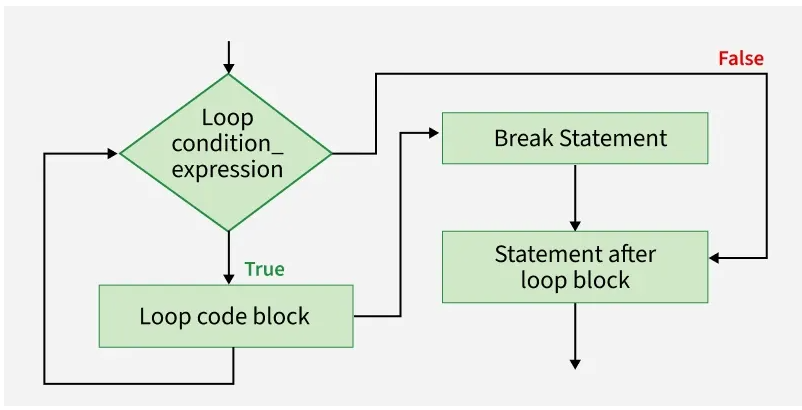

### Example with Loop (Full Program)
```cpp
#include <iostream>
using namespace std;

int main() {
    for (int i = 1; i <= 5; i++) {
        if (i == 3) {
            break;   // exits the loop completely
        }
        cout << i << " ";
    }
    return 0;
}
```
Output
```cpp
1 2
```

### Example with `switch` (Full Program)
```cpp
#include <iostream>
using namespace std;

int main() {
    int choice = 2;

    switch (choice) {
        case 1:
            cout << "Option 1";
            break;
        case 2:
            cout << "Option 2";
            break;
        default:
            cout << "Invalid choice";
    }

    return 0;
}
```
### Key Points
* Terminates the loop or switch
* Control exits the current block
* Commonly used in `switch` statements

### Difference Between `break` and `continue`
| Feature         | `break`         | `continue`              |
| --------------- | --------------- | ----------------------- |
| Effect          | Terminates loop | Skips current iteration |
| Loop continues? | ❌ No            | ✅ Yes                   |
| Used in         | Loops & switch  | Loops only              |


