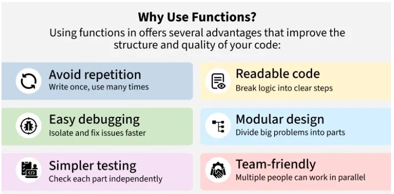
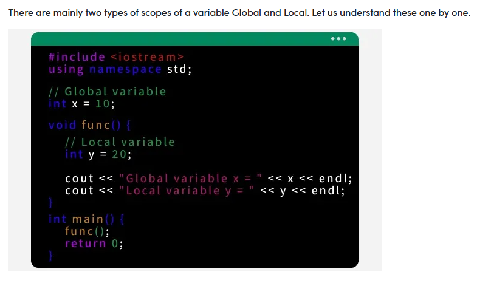

## 📘 Functions in C++ (In-Depth)

Functions are one of the **most important building blocks** in C++.
They help us write **clean, modular, reusable, and maintainable code**.

### 🔹 What is a Function in C++?

A **function** is a reusable block of code designed to perform a **specific task**.

Instead of writing the same logic again and again, we place it inside a function
and **call it whenever required**.



### Why Functions are Important?

- Break large programs into **smaller logical parts**
- Improve **code readability**
- Enable **code reuse**
- Make debugging and maintenance easier
- Reduce repetition (DRY principle – Don’t Repeat Yourself)

Just like other programming languages, C++ functions:
- Can take **inputs** (parameters)
- Execute a block of statements
- Can **return a value** (optional)

C++ also supports advanced features such as:
- Function Overloading
- Default Arguments
- Inline Functions

### 🔹 Example: Simple Program with Multiple Functions

Below is a **full-length C++ program** demonstrating:
- `main()` function
- `hello()` function
- `square(int x)` function

```cpp
#include <iostream>
using namespace std;

// Function to print a greeting
void hello() {
    cout << "Hello! Welcome to Functions in C++." << endl;
}

// Function to calculate square of a number
int square(int x) {
    return x * x;
}

int main() {
    // Calling hello function
    hello();

    int num = 5;

    // Calling square function
    int result = square(num);

    cout << "Square of " << num << " is: " << result << endl;

    return 0;
}
```
### 🖥️ Output
```cpp
Hello! Welcome to Functions in C++.
Square of 5 is: 25
```

### 🔹 Understanding Function Structure and Usage

Every function in C++ follows a **well-defined structure**.

### General Flow:
1. Function is **declared** (optional but recommended)
2. Function is **defined**
3. Function is **called**
4. Control returns back to the calling function

### Function Syntax in C++
```cpp
return_type function_name(parameter_list) {
    // function body
}
```
### Components Explained
| Component          | Description                                                       |
| ------------------ | ----------------------------------------------------------------- |
| **Return Type**    | Type of value the function returns (`int`, `void`, `float`, etc.) |
| **Function Name**  | Identifier used to call the function                              |
| **Parameter List** | Inputs passed to the function (can be empty)                      |
| **Function Body**  | Set of statements executed when function is called                |


### 🔹 Example: Function Syntax Breakdown
```cpp
int square(int x) {
    return x * x;
}
```
* `int` → return type
* `square` → function name
* `int x` → parameter
* `return x * x;` → function body

### 🔹 Function Declaration vs Function Definition
#### 🔸 Function Declaration

Tells the compiler **what the function looks like**.
```cpp
int square(int x);
```
* No function body
* Ends with semicolon `;`
* Also called **function prototype**

### 🔸 Function Definition

Contains the **actual implementation**.
```cpp
int square(int x) {
    return x * x;
}
```

### 🔹 Why is Function Declaration Needed in C++?

C++ is a **compiled language.**
The compiler reads code **from top to bottom**.

If a function is defined **after** `main()`, the compiler must know:
* Function name
* Return type
* Parameters

Otherwise, it throws an error.

### 🔹 Example Without Declaration (❌ Error)
```cpp
#include <iostream>
using namespace std;

int main() {
    cout << square(4); // ❌ compiler error
    return 0;
}

int square(int x) {
    return x * x;
}
```
### 🔹 Correct Example With Declaration (✅)
```cpp
#include <iostream>
using namespace std;

// Function declaration
int square(int x);

int main() {
    cout << square(4);
    return 0;
}

// Function definition
int square(int x) {
    return x * x;
}
```

### 🔹 Calling a Function in C++

Calling a function means **transferring control** from one function to another.

### Syntax:
```cpp
function_name(arguments);
```
### 🔹 Full Example: Function Call Flow
```cpp
#include <iostream>
using namespace std;

// Function declarations
void greet();
int add(int a, int b);

// Function definitions
void greet() {
    cout << "Welcome to Function Calls!" << endl;
}

int add(int a, int b) {
    return a + b;
}

int main() {
    greet(); // calling greet()

    int sum = add(10, 20); // calling add()

    cout << "Sum is: " << sum << endl;

    return 0;
}
```
### 🖥️ Output
```cpp
Welcome to Function Calls!
Sum is: 30
```
### 🔹 Key Observations

* `main()` is also a function
* Functions can call **other functions**
* After execution, control always **returns back** to the calling function
* `void` functions do not return values
* Non-void functions **must return** a value

### ✅ Summary
* Functions improve **structure and readability**
* C++ functions can take parameters and return values
* Function declaration helps the compiler
* `main()` is the entry point of every program
* Functions allow modular and reusable code

---

## 📘 Types of Functions in C++ (Detailed Explanation)

In C++, functions can be classified in **multiple ways** based on:
- **Who provides the function**
- **How the function interacts with input and output**

Understanding these classifications helps you **design better programs**, choose the **right function type**, and write **clean, flexible code**.

### 🔹 1. Types of Functions Based on Origin

Based on **where the function comes from**, C++ functions are divided into:

#### 1️⃣ Library Functions  
#### 2️⃣ User-Defined Functions  

### 🔸 1.1 Library Functions

**Library functions** are **predefined functions** provided by C++ standard libraries.
They are already implemented, tested, and optimized.

You only need to:
- Include the appropriate **header file**
- Call the function directly

### ✅ Examples of Library Functions

| Function | Purpose | Header File |
|--------|--------|------------|
| `cout` | Output to screen | `<iostream>` |
| `cin` | Input from user | `<iostream>` |
| `sqrt()` | Square root | `<cmath>` |
| `abs()` | Absolute value | `<cmath>` |
| `getline()` | Read a full line | `<string>` |

---

### 🔹 Example: Using Library Functions

```cpp
#include <iostream>
#include <cmath>
#include <string>

using namespace std;

int main() {
    int x = -25;
    double y = 16;

    cout << "Absolute value: " << abs(x) << endl;
    cout << "Square root: " << sqrt(y) << endl;

    string name;
    cout << "Enter your name: ";
    getline(cin, name);
    cout << "Hello, " << name << endl;

    return 0;
}
```
### 🖥️ Output (Sample)
```cpp
Absolute value: 25
Square root: 4
Enter your name: Charan
Hello, Charan
```

### 🔸 1.2 User-Defined Functions

**User-defined functions** are functions created by the programmer to perform
specific tasks according to program needs.

They:
 * Improve modularity
 * Avoid repetition
 * Make programs easier to understand and maintain

### 🔹 Example: User-Defined Function
```cpp
#include <iostream>
using namespace std;

// User-defined function
void greet() {
    cout << "Welcome to User-Defined Functions!" << endl;
}

int main() {
    greet(); // function call
    return 0;
}
```

### 🔹 2. Types of User-Defined Functions
**Based on Input and Return Type**

User-defined functions can also be classified based on:
* Whether they accept parameters
* Whether they return a value

This classification is **very important** in C++ and frequently asked in exams and interviews.

### 🔸 2.1 No Parameters, No Return Value
➤ Description
* The function does not take input
* The function does not return any value
* Mostly used for printing messages or performing fixed tasks

### 🔹 Syntax
```cpp
void functionName() {
    // code
}
```
### 🔹 Example
```cpp
#include <iostream>
using namespace std;

void displayMessage() {
    cout << "This function has no parameters and no return value." << endl;
}

int main() {
    displayMessage();
    return 0;
}
```

### 🔸 2.2 Parameters, No Return Value
➤ Description
* The function **takes input**
* The function **does not return any value**
* Used when processing is needed but result is printed directly

### 🔹 Syntax
```cpp
void functionName(type param) {
    // code
}
```
### 🔹 Example
```cpp
#include <iostream>
using namespace std;

void printSquare(int x) {
    cout << "Square is: " << x * x << endl;
}

int main() {
    printSquare(6);
    return 0;
}
```

### 🔸 2.3 No Parameters, Return Value
➤ Description
* The function **does not take input**
* The function **returns a value**
* Used when a fixed result is needed

### 🔹 Syntax
```cpp
type functionName() {
    return value;
}
```
### 🔹 Example
```cpp
#include <iostream>
using namespace std;

int getNumber() {
    return 10;
}

int main() {
    int x = getNumber();
    cout << "Returned value: " << x << endl;
    return 0;
}
```

### 🔸 2.4 Parameters and Return Value
➤ Description
* The function **takes input**
* The function **returns a value**
* Most commonly used and most powerful type

### 🔹 Syntax
```cpp
type functionName(type param1, type param2) {
    return result;
}
```
### 🔹 Example
```cpp
#include <iostream>
using namespace std;

int add(int a, int b) {
    return a + b;
}

int main() {
    int sum = add(10, 20);
    cout << "Sum is: " << sum << endl;
    return 0;
}
```

### 🔹 Comparison Table: Types of User-Defined Functions
| Function Type        | Parameters | Return Value | Example Use Case          |
| -------------------- | ---------- | ------------ | ------------------------- |
| No params, no return | ❌          | ❌            | Printing messages         |
| Params, no return    | ✅          | ❌            | Printing processed output |
| No params, return    | ❌          | ✅            | Returning fixed values    |
| Params, return       | ✅          | ✅            | Calculations and logic    |

### 🔹 Why This Classification Matters
* Helps choose the **right design** for a function
* Improves **code clarity**
* Avoids unnecessary global variables
* Makes programs **scalable and maintainable**

### ✅ Summary
* Functions can be **library** or **user-defined**
* User-defined functions are classified by **parameters and return type**
* Choosing the correct function type improves program structure
* Mastery of functions is essential for **DSA, OOP, and real-world C++ projects**

---

# 📘 Parameters (Arguments) and Lambda Functions in C++

This section continues our **Functions in C++** journey and focuses on:
- **Parameters / Arguments** (how data is passed to functions)
- **Lambda Functions** (modern C++ feature for inline, anonymous functions)

These concepts are **very important** for writing clean, efficient, and modular C++ programs.

---

## 🔹 Parameters / Arguments in C++

### 🔸 What are Parameters and Arguments?

- **Parameters** are variables listed in a function definition.
- **Arguments** are the actual values passed to the function when it is called.

📌 In simple words:
> **Parameters receive data, Arguments send data.**

---

### 🔹 Example: Basic Function with Parameters

```cpp
#include <iostream>
using namespace std;

void greet(string name) {   // parameter
    cout << "Hello, " << name << endl;
}

int main() {
    greet("Charan");       // argument
    return 0;
}
```
### 🖥️ Output
```cpp
Hello, Charan
```

### 🔹 Types of Parameters in C++

Parameters can be classified based on **how data is passed** to a function.

### 1️⃣ Call by Value
➤ Description
* A **copy** of the argument is passed
* Changes inside the function do not affect the original variable
* Safer but slightly less efficient for large data

### 🔹 Example
```cpp
#include <iostream>
using namespace std;

void increment(int x) {
    x = x + 1;
    cout << "Inside function: " << x << endl;
}

int main() {
    int a = 10;
    increment(a);
    cout << "Outside function: " << a << endl;
    return 0;
}
```
### 🖥️ Output
```cpp
Inside function: 11
Outside function: 10
```

### 2️⃣ Call by Reference
➤ Description
* The **original variable** is passed using a reference
* Changes inside the function **affect the original variable**
* More efficient and commonly used

### 🔹 Example
```cpp
#include <iostream>
using namespace std;

void increment(int &x) {
    x = x + 1;
}

int main() {
    int a = 10;
    increment(a);
    cout << "Value after function call: " << a << endl;
    return 0;
}
```
### 🖥️ Output
```cpp
Value after function call: 11
```

### 3️⃣ Call by Pointer (Address Passing)
➤ Description
* Address of variable is passed using pointers
* Requires dereferencing inside the function
* Useful in low-level programming

### 🔹 Example
```cpp
#include <iostream>
using namespace std;

void increment(int *x) {
    (*x)++;
}

int main() {
    int a = 10;
    increment(&a);
    cout << "Value after function call: " << a << endl;
    return 0;
}
```

### 🔹 Default Parameters
➤ Description
* Default values are assigned to parameters
* If argument is not passed, default value is used

### 🔹 Example
```cpp
#include <iostream>
using namespace std;

void printValue(int x = 5) {
    cout << x << endl;
}

int main() {
    printValue();
    printValue(20);
    return 0;
}
```
### 🖥️ Output
```cpp
5
20
```

### 🔹 Constant Parameters (`const`)
➤ Description
* Prevents modification of parameters
* Improves safety and readability

### 🔹 Example
```cpp
#include <iostream>
using namespace std;

void display(const int x) {
    cout << x << endl;
}

int main() {
    int a = 10;
    display(a);
    return 0;
}
```

### 🔹 Comparison Table: Parameter Passing
| Method            | Changes Original? | Efficiency | Use Case        |
| ----------------- | ----------------- | ---------- | --------------- |
| Call by Value     | ❌ No              | Medium     | Simple data     |
| Call by Reference | ✅ Yes             | High       | Most common     |
| Call by Pointer   | ✅ Yes             | High       | Low-level logic |
| Default Params    | Optional          | High       | Flexible APIs   |

### 🔹 Lambda Functions in C++
### 🔸 What is a Lambda Function?

A **lambda function** is an **anonymous function** (function without a name)
defined inline where it is needed.

Introduced in C++11, lambda functions make code:
* Shorter
* Cleaner
* More readable

📌 Lambda functions are widely used in:
* STL algorithms
* Functional programming
* Callbacks

### 🔹 Basic Lambda Syntax
```cpp
[capture](parameters) -> return_type {
    function body
};
```

### Components Explained
| Part | Meaning                |
| ---- | ---------------------- |
| `[]` | Capture clause         |
| `()` | Parameters             |
| `->` | Return type (optional) |
| `{}` | Function body          |

### 🔹 Example 1: Simple Lambda Function
```cpp
#include <iostream>
using namespace std;

int main() {
    auto greet = []() {
        cout << "Hello from Lambda!" << endl;
    };

    greet();
    return 0;
}
```

### 🔹 Example 2: Lambda with Parameters and Return Value
```cpp
#include <iostream>
using namespace std;

int main() {
    auto square = [](int x) {
        return x * x;
    };

    cout << square(5) << endl;
    return 0;
}
```

### 🔹 Capture Clause in Lambda
➤ Capture by Value [`=`]
```cpp
#include <iostream>
using namespace std;

int main() {
    int x = 10;

    auto show = [=]() {
        cout << x << endl;
    };

    show();
    return 0;
}
```

### ➤ Capture by Reference [`&`]
```cpp
#include <iostream>
using namespace std;

int main() {
    int x = 10;

    auto increment = [&]() {
        x++;
    };

    increment();
    cout << x << endl;
    return 0;
}
```

### 🔹 Lambda vs Normal Function
| Feature      | Lambda    | Normal Function |
| ------------ | --------- | --------------- |
| Name         | ❌ No      | ✅ Yes           |
| Inline usage | ✅ Yes     | ❌ No            |
| Short logic  | ✅ Best    | ❌ Verbose       |
| Reusability  | ❌ Limited | ✅ High          |

### 🔹 When to Use Lambda Functions?

✅ When logic is:
* Short
* Used once
* Closely related to current code

❌ Avoid lambdas for:
* Large logic
* Reusable business functions

✅ Summary
* Parameters control how data flows into functions
* Use references for efficiency
* Lambda functions enable inline, anonymous logic
* Lambdas are heavily used in modern **C++ and STL**

---

## 🔹 Scope of Variables in C++

The **scope of a variable** defines **where the variable can be accessed and used**
inside a program.  
Understanding scope is extremely important because it directly affects:

- Variable visibility
- Memory usage
- Program correctness
- Avoiding logical bugs in large programs

In C++, variables are mainly classified into **Global** and **Local** scopes, with
some additional specialized variations.

### 🔸 Types of Variable Scope in C++

There are mainly **two primary scopes** of variables:

1. **Global Scope**
2. **Local Scope**

Let us understand these one by one.

### 🔹 Global vs Local Scope in C++



### 🔹 Global Scope

A **global variable** is declared **outside all functions**, usually at the top of
the program.

### ✅ Characteristics of Global Variables

- Declared outside any function or block
- Accessible throughout the program
- Stored in a fixed memory location
- Exists for the entire lifetime of the program

### 📌 Example: Global Variable

```cpp
#include <iostream>
using namespace std;

// Global variable
int x = 10;

void display() {
    cout << "Value of x inside display(): " << x << endl;
}

int main() {
    cout << "Value of x inside main(): " << x << endl;
    display();
    return 0;
}
```
### 🖨️ Output
```cpp
Value of x inside main(): 10
Value of x inside display(): 10
```

✔️ The global variable `x` is accessible inside **all functions**.

### 🔹 Local Scope

A **local variable** is declared **inside a function or a block**.

### ✅ Characteristics of Local Variables
* Declared inside a function or block `{ }`
* ccessible only within that function or block
* Destroyed once the block execution ends
* Stored in stack memory

### 📌 Example: Local Variable
```cpp
#include <iostream>
using namespace std;

void func() {
    int y = 20;  // Local variable
    cout << "Local variable y: " << y << endl;
}

int main() {
    func();
    // cout << y; ❌ Error: y is not accessible here
    return 0;
}
```

✔️ The variable `y` exists **only inside** `func()`.

### 🔹 Global vs Local Scope (Comparison)
| Feature       | Global Variable                 | Local Variable          |
| ------------- | ------------------------------- | ----------------------- |
| Declaration   | Outside all functions           | Inside a function/block |
| Accessibility | Entire program                  | Only within the block   |
| Lifetime      | Entire program execution        | During block execution  |
| Memory        | Static memory                   | Stack memory            |
| Risk          | High (can be modified anywhere) | Low (limited access)    |

### 🔹 Variable Shadowing
**❓ What happens when we declare a local variable with the same name as a global?**

➡️ **Variable Shadowing** occurs.

> The local variable **hides (shadows)** the global variable inside its scope.

### 📌 Example: Variable Shadowing
```cpp
#include <iostream>
using namespace std;

// Global variable
int value = 100;

void show() {
    int value = 50;  // Local variable shadows global
    cout << "Local value: " << value << endl;
}

int main() {
    show();
    cout << "Global value: " << value << endl;
    return 0;
}
```
### 🖨️ Output
```cpp
Local value: 50
Global value: 100
```

✔️ Inside `show()`, the **local variable takes priority**.

### 📌 Example: Accessing Global Variable using `::`
```cpp
#include <iostream>
using namespace std;

int count = 10;  // Global variable

void demo() {
    int count = 5;  // Local variable
    cout << "Local count: " << count << endl;
    cout << "Global count: " << ::count << endl;
}

int main() {
    demo();
    return 0;
}
```
### 🖨️ Output
```cpp
Local count: 5
Global count: 10
```

✔️ `::count` explicitly refers to the **global variable**.

### 🔹 Variations of Scopes in C++

Apart from global and local scope, C++ supports **specialized scope variations**
based on **accessibility and visibility**.

### 🔸 1️⃣ Instance Scope

Instance scope refers to **non-static data members of a class.**

✅ Characteristics
* Each object has its own copy
* Accessible using object name
* Exists as long as the object exists

### 📌 Example: Instance Scope
```cpp
#include <iostream>
using namespace std;

class Student {
public:
    int marks;  // Instance variable
};

int main() {
    Student s1, s2;
    s1.marks = 80;
    s2.marks = 90;

    cout << s1.marks << endl;
    cout << s2.marks << endl;
    return 0;
}
```

✔️ Each object maintains **separate instance data**.

### 🔸 2️⃣ Static Member Scope

Static members are **shared among all objects** of a class.

### ✅ Characteristics
* Single copy shared by all objects
* Declared using `static`
* Exists throughout program execution

### 📌 Example: Static Member Scope
```cpp
#include <iostream>
using namespace std;

class Counter {
public:
    static int count;
};

int Counter::count = 0;

int main() {
    Counter::count++;
    Counter::count++;

    cout << "Count: " << Counter::count << endl;
    return 0;
}
```

✔️ Static variables belong to the class, not objects.

### 🔸 3️⃣ Namespace Scope

Variables declared inside **a namespace** have namespace scope.

### ✅ Characteristics
* Prevents name conflicts
* Organizes large programs
* Accessed using `::`

### 📌 Example: Namespace Scope
```cpp
#include <iostream>
using namespace std;

namespace Data {
    int value = 42;
}

int main() {
    cout << Data::value << endl;
    return 0;
}
```

✔️ Namespaces provide **logical grouping and scope control**.

### ✅ Summary
* Scope controls **where a variable is accessible**
* Global and local scopes form the foundation
* Variable shadowing can hide global variables
* `::` helps access global variables
* Advanced scopes improve structure and safety in large programs

⭐ Understanding scope is critical for writing clean, bug-free C++ programs.

---

