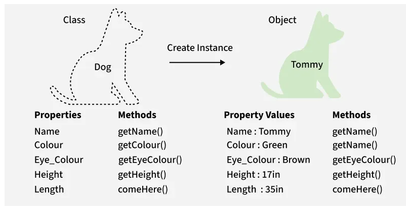

# 📘 C++ Classes and Objects (OOP Foundations)

This note covers **C++ Classes and Objects** in a **deep, beginner-friendly, and structured way**,  
aligned with **GeeksforGeeks – Classes and Objects** and written to support **DSA + problem solving**.

Reference (for concept alignment):  
👉 https://www.geeksforgeeks.org/cpp/c-classes-and-objects/

### 🔹 What is Object-Oriented Programming (OOP)?

Object-Oriented Programming is a programming paradigm that organizes code using:
- **Objects** → real-world entities
- **Classes** → blueprints of objects

### Why OOP?
- Code reusability
- Better structure
- Easier maintenance
- Real-world modeling




### 🔹 What is a Class in C++?

A **class** is a **user-defined data type** that groups:
- **Data members** (variables)
- **Member functions** (methods)

### Syntax of a Class
```cpp
class ClassName {
    // access specifier
    data members;
    member functions;
};
```

### 🔹 What is an Object in C++?

An **object** is an **instance of a class**.
It represents a real-world entity created using a class.

> Class = Blueprint
> Object = Actual implementation

### 🔹 Example: Class and Object (Basic)
```cpp
#include <iostream>
using namespace std;

class Student {
public:
    int roll;
    string name;

    void display() {
        cout << roll << " " << name << endl;
    }
};

int main() {
    Student s1;        // Object creation
    s1.roll = 101;     // Member access
    s1.name = "Alex";

    s1.display();      // Calling member function
    return 0;
}
```

### 🔹 Creating an Object in C++

**Objects** can be created in **multiple ways**:

### 1️⃣ Normal Object Creation
```cpp
Student s1;
```

### 2️⃣ Using Pointer
```cpp
Student* s2 = new Student;
s2->roll = 102;
```

### 🔹 Member Access in C++
| Operator | Used With      |
| -------- | -------------- |
| `.`      | Normal object  |
| `->`     | Pointer object |

### Example
```cpp
s1.roll = 10;   // dot operator
s2->roll = 20; // arrow operator
```

### 🔹 Access Specifiers in C++
| Specifier   | Accessibility                |
| ----------- | ---------------------------- |
| `public`    | Accessible everywhere        |
| `private`   | Accessible only inside class |
| `protected` | Used in inheritance          |

### Example
```cpp
class Demo {
private:
    int x;

public:
    void set(int a) {
        x = a;
    }
};
```
### 🔹 Local Class

A **local class** is a class defined **inside a function**.

**Key Points**
* Scope limited to the function
* Cannot have static data members
* Used rarely but important conceptually

### Example
```cpp
#include <iostream>
using namespace std;

void func() {
    class Local {
    public:
        void show() {
            cout << "Local Class" << endl;
        }
    };

    Local obj;
    obj.show();
}

int main() {
    func();
    return 0;
}
```

### 🔹 Nested Class
A **nested class** is a class defined **inside another class**.

**Key Points**
* Improves logical grouping
* Inner class does NOT automatically access outer class members

### Example
```cpp
#include <iostream>
using namespace std;

class Outer {
public:
    class Inner {
    public:
        void display() {
            cout << "Nested Class" << endl;
        }
    };
};

int main() {
    Outer::Inner obj;
    obj.display();
    return 0;
}
```

### 🔹 Enum Class (Scoped Enumeration)

Introduced in C++11, `enum class`:
* Avoids name conflicts
* Provides strong type safety

### Normal Enum (Problem)
```cpp
enum Color { RED, BLUE };
enum Traffic { RED, GREEN }; // ❌ conflict
```
### Enum Class (Solution)
```cpp
enum class Color { RED, BLUE };
enum class Traffic { RED, GREEN };
```
### Usage
```cpp
Color c = Color::RED;
```

### 🔹 Class vs Object (Key Differences)
| Feature     | Class     | Object         |
| ----------- | --------- | -------------- |
| Definition  | Blueprint | Instance       |
| Memory      | No memory | Takes memory   |
| Declaration | Once      | Multiple times |
| Purpose     | Design    | Usage          |

### 🔹 Difference Between Class and Structure
| Feature        | Class     | Structure |
| -------------- | --------- | --------- |
| Default Access | Private   | Public    |
| OOP Usage      | Preferred | Less used |
| Inheritance    | Supported | Supported |

### 🔹 Important Notes for DSA
* Most STL containers (`vector`, `map`, etc.) are **classes**
* Understanding **objects & methods** is crucial
* Competitive programming uses OOP heavily

### 🔹 Common Beginner Mistakes
❌ Forgetting ; after class

❌ Using `.` instead of `->` for pointers

❌ Accessing private members directly

❌ Confusing class with object

### 🔹 Summary
* Class = Blueprint
* Object = Real instance
* Member access via `.` or `->`
* Local & Nested classes improve structure
* `enum class` is safer than normal enum
* OOP is **mandatory** for clean C++ & DSA

---

# 📦 C++ Standard Template Library (STL) – Complete Beginner to Intermediate Guide

The **Standard Template Library (STL)** is one of the most powerful features of C++.  
Instead of writing your own data structures and algorithms from scratch, STL provides **ready-made, optimized, and type-safe components**.

STL is built using **templates**, which means it works with **any data type**.

---

## 🔹 Why STL?

STL containers and algorithms are:

- ⚡ Fast and optimized
- ✅ Reliable and well-tested
- 🔁 Reusable
- 🧠 Easy to use
- 🔐 Type-safe
- ⏱️ Saves development time

---

## 🔑 Components of STL

STL is mainly divided into **3 core components**:

| Component   | Description |
|------------|-------------|
| Containers | Store data |
| Algorithms | Operate on data |
| Iterators  | Connect containers and algorithms |

---

## 📦 1. STL Containers

Containers are **data structures** that store objects in memory.

### 🔹 Types of Containers

### 1️⃣ Sequence Containers  
Store data in **linear order**.

| Container | Description |
|---------|-------------|
| `vector` | Dynamic array |
| `deque` | Double-ended queue |
| `list` | Doubly linked list |
| `forward_list` | Singly linked list |
| `array` | Fixed-size array |


### 2️⃣ Container Adaptors  
Provide restricted interfaces over containers.

| Adaptor | Description |
|--------|-------------|
| `stack` | LIFO |
| `queue` | FIFO |
| `priority_queue` | Max/Min heap |

### 3️⃣ Associative Containers  
Store data in **sorted order**.

| Container | Description |
|---------|-------------|
| `set` | Unique keys |
| `multiset` | Duplicate keys allowed |
| `map` | Key–value pairs |
| `multimap` | Duplicate keys allowed |

### 4️⃣ Unordered Associative Containers  
Use **hash tables** (faster average time).

| Container |
|----------|
| `unordered_set` |
| `unordered_multiset` |
| `unordered_map` |
| `unordered_multimap` |


## 📘 2. Vector in C++ STL

A **vector** is a dynamic array.

### ✅ Key Features
- Dynamic resizing
- Random access
- Fast insertion at end

### Example:
```cpp
#include <iostream>
#include <vector>
using namespace std;

int main() {
    vector<int> v;

    v.push_back(10);
    v.push_back(20);
    v.push_back(30);

    for(int x : v) {
        cout << x << " ";
    }

    return 0;
}
```
## 📘 3. Set in C++ STL
* Stores **unique elements**
* Automatically sorted
```cpp
#include <iostream>
#include <set>
using namespace std;

int main() {
    set<int> s;

    s.insert(10);
    s.insert(5);
    s.insert(10); // ignored

    for(int x : s)
        cout << x << " ";

    return 0;
}
```

## 📘 4. Map in C++ STL

Stores **key–value pairs** (sorted by key).
```cpp
#include <iostream>
#include <map>
using namespace std;

int main() {
    map<int, string> m;

    m[1] = "One";
    m[2] = "Two";

    for(auto p : m)
        cout << p.first << " -> " << p.second << endl;

    return 0;
}
```
## 📘 5. Unordered Map
* Uses hashing
* Faster than `map`
* No sorting order
```cpp
#include <iostream>
#include <unordered_map>
using namespace std;

int main() {
    unordered_map<int, int> um;

    um[1] = 100;
    um[2] = 200;

    for(auto p : um)
        cout << p.first << " " << p.second << endl;

    return 0;
}
```

## 📘 6. Stack in C++ STL (LIFO – Last In First Out)

A **stack** is a container adaptor that follows the **LIFO principle**:
> The element inserted last is removed first.

### 🧠 Real-life analogy
Think of a stack of plates:
- You put a plate on top
- You remove the plate from the top

## 🔹 Key Characteristics of Stack
- No random access (cannot access middle elements)
- Only access the **top element**
- Operations are fast (O(1))

## 🔹 Common Stack Operations

| Operation | Description |
|---------|-------------|
| `push()` | Insert element at top |
| `pop()` | Remove top element |
| `top()` | Access top element |
| `empty()` | Check if stack is empty |
| `size()` | Number of elements |

### ✅ Example Code
```cpp
#include <iostream>
#include <stack>
using namespace std;

int main() {
    stack<int> st;

    st.push(10);
    st.push(20);
    st.push(30);

    cout << st.top() << endl; // 30

    st.pop(); // removes 30

    cout << st.top() << endl; // 20

    return 0;
}
```

### 🟢 Where Stack is Used?
* Function calls (call stack)
* Undo/Redo operations
* Expression evaluation
* Backtracking problems

## 📘 7. Queue in C++ STL (FIFO – First In First Out)

A **queue** follows the **FIFO principle**:

> The element inserted first is removed first.

### 🧠 Real-life analogy

Think of a queue at a ticket counter:
* First person enters
* First person gets served

### 🔹 Common Queue Operations
| Operation | Description               |
| --------- | ------------------------- |
| `push()`  | Insert element at rear    |
| `pop()`   | Remove element from front |
| `front()` | Access front element      |
| `back()`  | Access last element       |
| `empty()` | Check if queue is empty   |

### ✅ Example Code
```cpp
#include <iostream>
#include <queue>
using namespace std;

int main() {
    queue<int> q;

    q.push(10);
    q.push(20);
    q.push(30);

    cout << q.front() << endl; // 10
    q.pop();

    cout << q.front() << endl; // 20

    return 0;
}
```

### 🟢 Where Queue is Used?
* Scheduling tasks
* Breadth First Search (BFS)
* Printer jobs
* CPU scheduling

## 📘 8. Priority Queue in C++ STL

A **priority_queue** is a special type of queue where:

> The element with **highest priority** is served first.

### By default:
* It behaves as a **max heap**
* Largest element comes first

### 🔹 Types of Priority Queue

* **Max Heap** (default)
* **Min Heap** (using comparator)

### ✅ Max Heap Example
```cpp
#include <iostream>
#include <queue>
using namespace std;

int main() {
    priority_queue<int> pq;

    pq.push(10);
    pq.push(40);
    pq.push(20);

    cout << pq.top(); // 40

    return 0;
}
```

### ✅ Min Heap Example
```cpp
priority_queue<int, vector<int>, greater<int>> pq;
```

### 🟢 Where Priority Queue is Used?
* Dijkstra’s algorithm
* Scheduling based on priority
* Heap-based problems
* Top K problems

## 🔁 9. Iterators in C++ STL

Iterators are **pointer-like objects** that allow us to traverse containers.

They act as a **bridge between containers and algorithms**.

### 🔹 Why Iterators Are Important?
* Algorithms don’t work directly on containers
* Algorithms work on **iterator ranges**
* Makes STL flexible and generic

### 🔹 Common Iterator Functions
| Function   | Meaning                   |
| ---------- | ------------------------- |
| `begin()`  | Points to first element   |
| `end()`    | Points after last element |
| `rbegin()` | Reverse begin             |
| `rend()`   | Reverse end               |

### ✅ Example Code
```cpp
#include <iostream>
#include <vector>
using namespace std;

int main() {
    vector<int> v = {10, 20, 30};

    for(auto it = v.begin(); it != v.end(); it++) {
        cout << *it << " ";
    }

    return 0;
}
```

## ⚙️ 10. STL Algorithms in C++

STL provides **ready-made algorithms** for common operations.

### 📌 Header Files
```cpp
#include <algorithm>
#include <numeric>
```

### 🔹 Most Used STL Algorithms
#### 🔸 sort()

Sorts elements in ascending order.
```cpp
sort(v.begin(), v.end());
```

#### 🔸 binary_search()

Checks if element exists (only on sorted container).
```cpp
binary_search(v.begin(), v.end(), 20);
```

### 🔸 find()

Finds first occurrence of element.
```cpp
auto it = find(v.begin(), v.end(), 10);
```

### 🔸 count()

Counts occurrences of a value.
```cpp
count(v.begin(), v.end(), 5);
```

#### 🔸 reverse()

Reverses container.
```cpp
reverse(v.begin(), v.end());
```

#### 🔸 accumulate()

Finds sum of elements.
```cpp
int sum = accumulate(v.begin(), v.end(), 0);
```

#### 🔸 unique()

Removes consecutive duplicates.
```cpp
v.erase(unique(v.begin(), v.end()), v.end());
```

#### 🔸 lower_bound()

First element ≥ value.
```cpp
lower_bound(v.begin(), v.end(), x);
```

#### 🔸 upper_bound()

First element > value.
```cpp
upper_bound(v.begin(), v.end(), x);
```

#### 🔸 replace()

Replaces values.
```cpp
replace(v.begin(), v.end(), oldVal, newVal);
```

#### 🔸 next_permutation()

Generates next lexicographical permutation.
```cpp
next_permutation(v.begin(), v.end());
```

#### 🔸 __builtin_popcount()

Counts number of set bits.
```cpp
__builtin_popcount(15); // 4
```

#### 🔸 min_element() & max_element()
```cpp
*min_element(v.begin(), v.end());
*max_element(v.begin(), v.end());
```

## ✅ Benefits of C++ STL
| Benefit       | Explanation        |
| ------------- | ------------------ |
| ⏱️ Saves Time | No need to code DS |
| 🧪 Reliable   | Industry-tested    |
| ⚡ Fast        | Highly optimized   |
| ♻️ Reusable   | Generic templates  |
| 🧼 Clean Code | Short & readable   |

## 🎯 Final Takeaway

> **STL is the backbone of modern C++ programming.**

If you know:
* Containers
* Iterators
* Algorithms

You can solve **most DSA problems efficiently**.

📌 Mastering STL =
✔ Faster coding
✔ Cleaner logic
✔ Strong interview performance

**🔥 Strong STL knowledge turns average coders into confident problem solvers.**

---